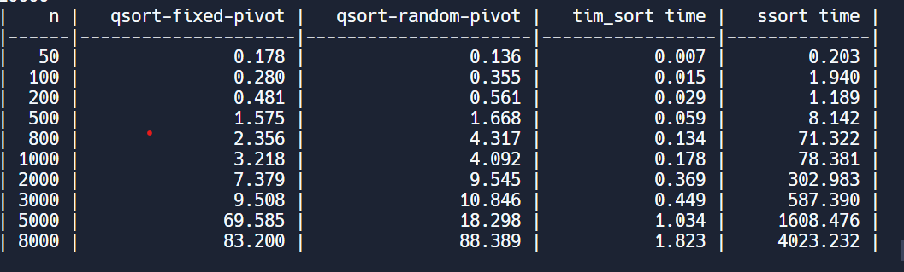

# CMPS 2200 Reciation 5
## Answers

**Name:**Jaimie Morris and Sofia Della Rosa

Place all written answers from `recitation-05.md` here for easier grading.

- **1b.**
- Task: compare the running times of compare search between variants of Quicksort and the provided implementation of selection sort.

- Answer: 

- Quicksort --> O(nlogn) complexity for the average case and O(n^2) for worst case
- Selection sort --> O(n^2) for average case and worst case 
- 

- **1c.**
- Table shown above.
- Timesort (sorted), labeled as tim_sort_t in the table is faster than the other sorting algorithms provided in this lab. This remains true for all of the list sizes that were tested. 